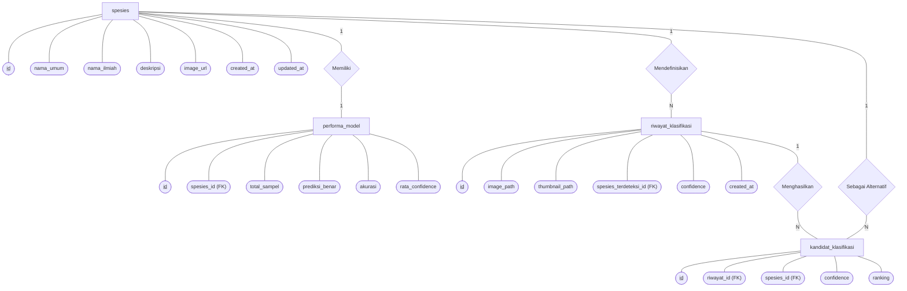

# Entity Relationship Diagram (ERD) & Narasi Database - Bab III Skripsi

Dokumen ini berisi rancangan **Entity Relationship Diagram (ERD)** yang telah disederhanakan untuk Sistem Klasifikasi Spesies Kupu-Kupu (**Lepidoptera Archive**). Struktur database ini telah disesuaikan dengan skema tanpa autentikasi pengguna (user-less application) untuk kebutuhan skripsi S1 Informatika.

---

## 1. Diagram ERD (Notasi Chen Klasik)

Berikut adalah visualisasi hubungan entitas (ERD) dalam bentuk Chen Notation (menggunakan objek persegi panjang untuk entitas, oval untuk atribut, belah ketupat untuk relasi, serta garis dengan label `1` dan `N` untuk kardinalitas):

---

## 2. Kamus Data (Data Dictionary)

### A. Tabel `spesies`
Tabel master data yang menyimpan katalog referensi taksonomi spesies kupu-kupu yang didukung oleh model klasifikasi EfficientNet-B0.

| Nama Kolom | Tipe Data | Batasan (Constraint) | Deskripsi |
| :--- | :--- | :--- | :--- |
| `id` | VARCHAR(50) | PK, NOT NULL | Kode pengenal spesies (format: `LPD-XXX`). |
| `nama_umum` | VARCHAR(100) | UNIQUE, NOT NULL | Nama umum spesies (misal: `MONARCH`). |
| `nama_ilmiah` | VARCHAR(100) | UNIQUE, NOT NULL | Nama binomial ilmiah Latin (misal: `Danaus plexippus`). |
| `deskripsi` | TEXT | NOT NULL | Penjelasan karakteristik fisik dan morfologi spesies. |
| `image_url` | TEXT | NULL | Path aset gambar referensi (misal: `/assets/spesies/monarch.jpg`). |
| `created_at` | TIMESTAMP | DEFAULT NOW() | Tanggal data spesies ditambahkan ke database. |
| `updated_at` | TIMESTAMP | DEFAULT NOW() | Tanggal terakhir data spesies diperbarui. |

### B. Tabel `performa_model`
Tabel metrik performa model untuk masing-masing kelas/spesies kupu-kupu yang dihitung berdasarkan dataset pengujian. Data ini disajikan dalam grafik visual di halaman analitik.

| Nama Kolom | Tipe Data | Batasan (Constraint) | Deskripsi |
| :--- | :--- | :--- | :--- |
| `id` | UUID | PK, NOT NULL | Identifier unik berupa UUID. |
| `spesies_id` | VARCHAR(50) | FK (`spesies.id`), UNIQUE | Relasi satu-ke-satu ke tabel spesies. |
| `total_sampel` | INTEGER | NOT NULL | Jumlah total sampel uji untuk spesies ini. |
| `prediksi_benar` | INTEGER | NOT NULL | Jumlah prediksi benar pada dataset pengujian. |
| `akurasi` | NUMERIC | NOT NULL | Persentase akurasi: `(prediksi_benar / total_sampel) * 100`. |
| `rata_confidence` | NUMERIC | NOT NULL | Rata-rata persentase tingkat kepercayaan prediksi model. |

### C. Tabel `riwayat_klasifikasi`
Tabel transaksi yang mencatat setiap berkas gambar yang diidentifikasi oleh sistem beserta spesies terdeteksi (Top-1) dan tingkat confidence-nya.

| Nama Kolom | Tipe Data | Batasan (Constraint) | Deskripsi |
| :--- | :--- | :--- | :--- |
| `id` | VARCHAR(50) | PK, NOT NULL | ID transaksi riwayat (format: `HST-[timestamp]`). |
| `image_path` | TEXT | NOT NULL | URL gambar spesimen asli yang diunggah ke storage. |
| `thumbnail_path` | TEXT | NOT NULL | URL gambar thumbnail terkompresi untuk efisiensi loading. |
| `spesies_terdeteksi_id`| VARCHAR(50) | FK (`spesies.id`), Nullable | ID spesies hasil klasifikasi dengan kecocokan tertinggi. |
| `confidence` | NUMERIC | NOT NULL | Persentase keyakinan klasifikasi (contoh: `98.50`). |
| `created_at` | TIMESTAMP | DEFAULT NOW() | Waktu dilakukannya proses identifikasi. |

### D. Tabel `kandidat_klasifikasi`
Menyimpan daftar alternatif klasifikasi (Top-N Candidates, yaitu peringkat 1-4) yang dihasilkan oleh model AI untuk satu sesi klasifikasi.

| Nama Kolom | Tipe Data | Batasan (Constraint) | Deskripsi |
| :--- | :--- | :--- | :--- |
| `id` | UUID | PK, NOT NULL | ID unik untuk entri kandidat. |
| `riwayat_id` | VARCHAR(50) | FK (`riwayat_klasifikasi.id`) | Relasi ke sesi riwayat klasifikasi terkait. |
| `spesies_id` | VARCHAR(50) | FK (`spesies.id`) | Relasi ke spesies kandidat yang diusulkan oleh AI. |
| `confidence` | NUMERIC | NOT NULL | Tingkat kepercayaan untuk kandidat ini. |
| `ranking` | INTEGER | NOT NULL | Peringkat kandidat (1 = Top-1, 2 = Top-2, dst). |

---

## 3. Narasi Hubungan & Aturan Bisnis (Bab III Skripsi S1 Informatika)

Dalam perancangan database sistem klasifikasi spesies kupu-kupu ini, relasi antar tabel dimodelkan untuk mendukung proses perekaman hasil inferensi deep learning dan penyajian katalog data taksonomi. Hubungan antar entitas dijelaskan sebagai berikut:

1. **Relasi antara Entitas `spesies` dan `performa_model` (One-to-One / `1 : 1`)**
   - **Narasi**: Setiap spesies kupu-kupu yang terdaftar dalam database memiliki tepat satu catatan metrik performa model klasifikasi. Relasi diikat melalui foreign key `spesies_id` pada tabel `performa_model` yang merujuk ke primary key `id` pada tabel `spesies` dengan batasan `UNIQUE` (sehingga menjamin kardinalitas `1:1`).

2. **Relasi antara Entitas `spesies` dan `riwayat_klasifikasi` (One-to-Many / `1 : N`)**
   - **Narasi**: Satu spesies kupu-kupu dapat terdeteksi sebagai hasil prediksi utama (Top-1) pada nol atau banyak transaksi riwayat klasifikasi. Relasi diikat melalui foreign key `spesies_terdeteksi_id` pada tabel `riwayat_klasifikasi` yang merujuk ke `id` pada tabel `spesies`. Nilai foreign key ini bersifat nullable untuk menangani kasus klasifikasi dengan hasil yang tidak dikenali sama sekali oleh model (*unknown species*).

3. **Relasi antara Entitas `riwayat_klasifikasi` dan `kandidat_klasifikasi` (One-to-Many / `1 : N`)**
   - **Narasi**: Setiap satu sesi riwayat klasifikasi akan menghasilkan minimal satu atau beberapa kandidat spesies alternatif dengan tingkat kepercayaan (*confidence*) yang bervariasi (dalam sistem ini dibatasi pada Top-4 kandidat teratas). Hubungan diikat melalui foreign key `riwayat_id` pada tabel `kandidat_klasifikasi` yang mengacu pada primary key `id` di tabel `riwayat_klasifikasi` dengan aturan penghapusan bertingkat (`ON DELETE CASCADE`).

4. **Relasi antara Entitas `spesies` dan `kandidat_klasifikasi` (One-to-Many / `1 : N`)**
   - **Narasi**: Satu spesies kupu-kupu dapat muncul sebagai salah satu alternatif kandidat klasifikasi (baik peringkat 1, 2, 3, maupun 4) di dalam banyak entri transaksi kandidat klasifikasi. Relasi ini diikat menggunakan foreign key `spesies_id` pada tabel `kandidat_klasifikasi` yang merujuk ke primary key `id` pada tabel `spesies`.
